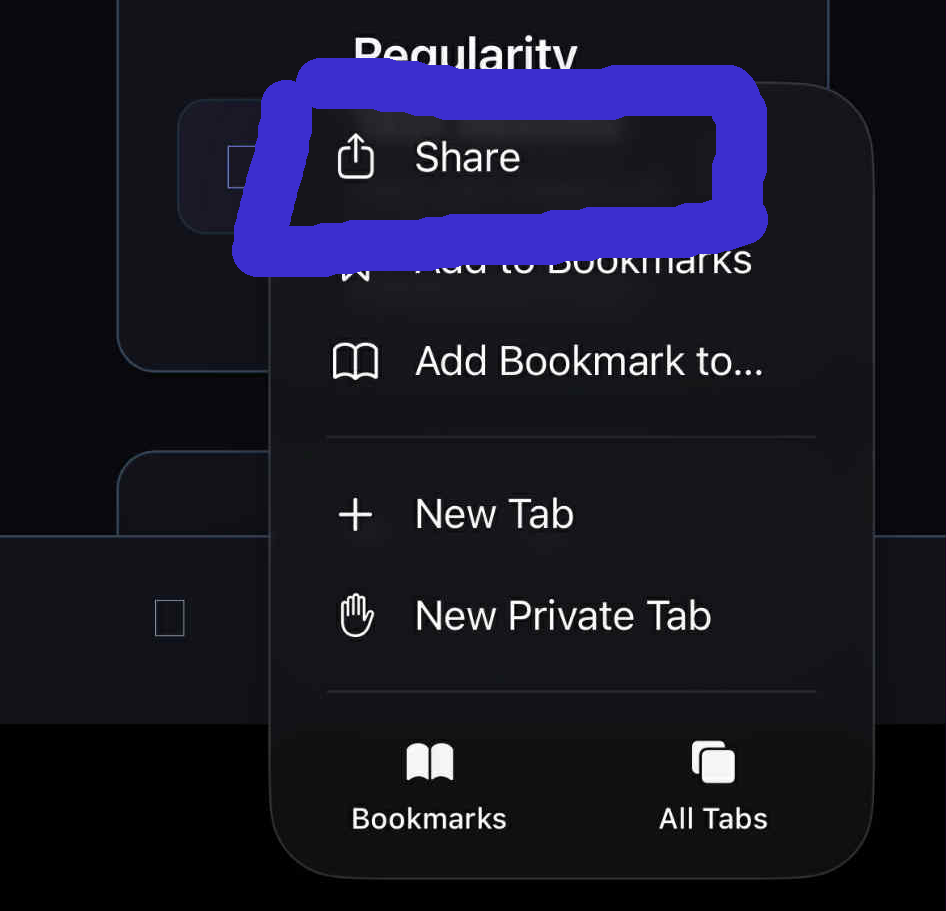
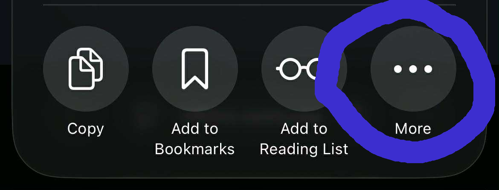
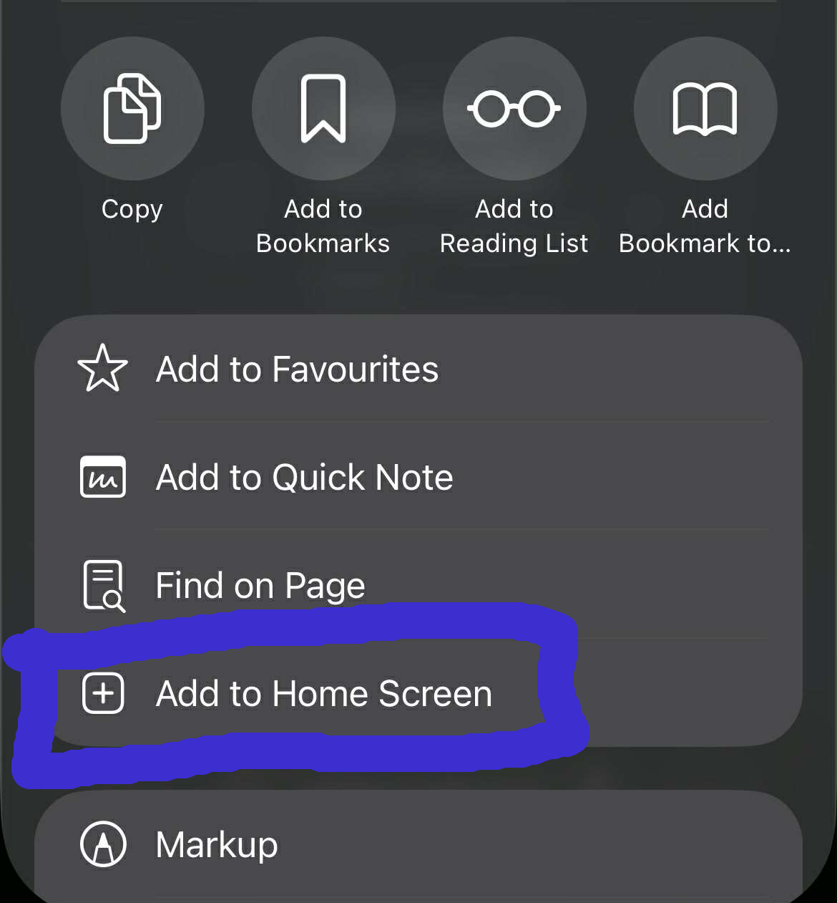

# Exported Results - Documentation

## Overview

This document provides detailed information about the exported results functionality in the ChronaFlow application. The application allows users to export test results to CSV files for further analysis and record-keeping. Each test type has its own unique data structure and meaning.

## Table of Contents

1. [How to run offline](#how-to-run-offline)
2. [General Export Functionality](#general-export-functionality)
3. [Regularity Test Results](#regularity-test-results)
4. [Passive Test Results](#passive-test-results)
5. [Active Test Results](#active-test-results)
6. [CSV File Format](#csv-file-format)

---

## How to run offline

ChronaFlow can work without internet after you open it once while you are online.

### Steps (Android)

1. Open `https://chronaflow.netlify.app` in Chrome or Brave.
2. Wait for the app to fully load.
3. Tap the browser menu and choose "Add to Home screen".
4. Open ChronaFlow from the new Home screen icon.
5. Turn off your internet and confirm the app still opens and runs.

**Screenshot placeholder:** [Android add to Home screen menu]

### Steps (iOS)

1. Open `https://chronaflow.netlify.app` in Safari (this does not work in other iOS browsers).
2. Wait for the app to fully load.
3. Tap the Share button.



4. Scroll and tap "More".



5. Tap "Add to Home Screen".



6. Open ChronaFlow from the new Home screen icon.
7. Turn off your internet and confirm the app still opens and runs.

### Notes

- If the app shows a blank screen, connect to the internet once, open it, then try again offline.
- When a new version is published, open the app online once to update it.
- If your phone is low on storage, it may remove offline files.

## 1. General Export Functionality

The application provides an `exportResults` utility function that handles the export of test results to CSV files. This function is used across all test result screens to ensure consistency.

### Features

- **CSV Format**: Results are exported in a structured CSV format for easy analysis.
- **Customizable**: Each test type defines its own CSV header, row formatting, and file naming conventions.
- **Sharing**: On mobile platforms, users can share the exported file directly.

---

## 2. Regularity Test Results

The Regularity Test measures a user's ability to maintain a consistent rhythm by tapping at 1-second intervals.

### Exported Data

The exported CSV file for Regularity Test results includes the following columns:

- **Day**: The date of the test result.
- **Time**: The time of the test result.
- **SessionId**: The ID of the session, if applicable.
- **Average Interval (s)**: The average time interval between taps in seconds.
- **Standard Deviation (s)**: The standard deviation of the intervals between taps in seconds.
- **Notes**: Any notes added by the user.
- **Timestamp1, Timestamp2, ..., Timestamp25 (ms)**: The timestamps of each of the 25 taps measured in milliseconds.

### Example Row

```
2023-10-01,10:30:00,session123,1000.123,50.456,"After Meditation",1000,2000,3000,...
```

### Interpretation

- **Average Interval**: Indicates how close the user was to maintaining a 1-second rhythm.
- **Standard Deviation**: Measures the variability in the user's tapping intervals. A lower value indicates better consistency.

---

## 3. Passive Test Results

The Passive Test evaluates a user's ability to estimate the duration of a visual stimulus.

### Exported Data

The exported CSV file for Passive Test results includes the following columns:

- **Day**: The date of the test result.
- **Time**: The time of the test result.
- **Session Id**: The ID of the session, if applicable.
- **Target Duration (ms)**: The actual duration for which the stimulus was displayed.
- **Your Duration (ms)**: The user's estimated duration.
- **Notes**: Any notes added by the user.

### Example Row

```
2023-10-01,11:00:00,session456,3000,3200,"User overestimated by 200ms"
```

### Interpretation

- **Target Duration**: The actual duration of the stimulus.
- **Your Duration**: The user's estimation of the duration.
- **Difference**: The difference between the target and user durations can be calculated to assess accuracy.

---

## 4. Active Test Results

The Active Test measures a user's ability to reproduce a target duration by pressing and holding a button.

### Exported Data

The exported CSV file for Active Test results includes the following columns:

- **Day**: The date of the test result.
- **Time**: The time of the test result.
- **Session Id**: The ID of the session, if applicable.
- **Target Duration (ms)**: The target duration the user was asked to reproduce.
- **Your Duration (ms)**: The duration the user actually held the button.
- **Notes**: Any notes added by the user.

### Example Row

```
2023-10-01,11:30:00,session789,5000,4800,"User underestimated by 200ms"
```

### Interpretation

- **Target Duration**: The duration the user was instructed to reproduce.
- **Your Duration**: The duration the user actually reproduced.
- **Difference**: The difference between the target and user durations can be calculated to assess accuracy.

---

## 5. CSV File Format

All exported CSV files follow a consistent format:

- **Header Row**: The first row contains the column headers.
- **Data Rows**: Each subsequent row represents a single test result.
- **Comma-Separated Values**: Values are separated by commas.
- **Quoting**: Text values are enclosed in double quotes to handle commas within the text.

### Example CSV File

```
Day,Time,Session Id,Target Duration (ms),Your Duration (ms),Notes
2023-10-01,11:30:00,session789,5000,4800,"User underestimated by 200ms"
```

---

## Summary

The exported results provide valuable insights into the user's performance across different cognitive tests. By analyzing the data, users can track their progress and identify areas for improvement.
